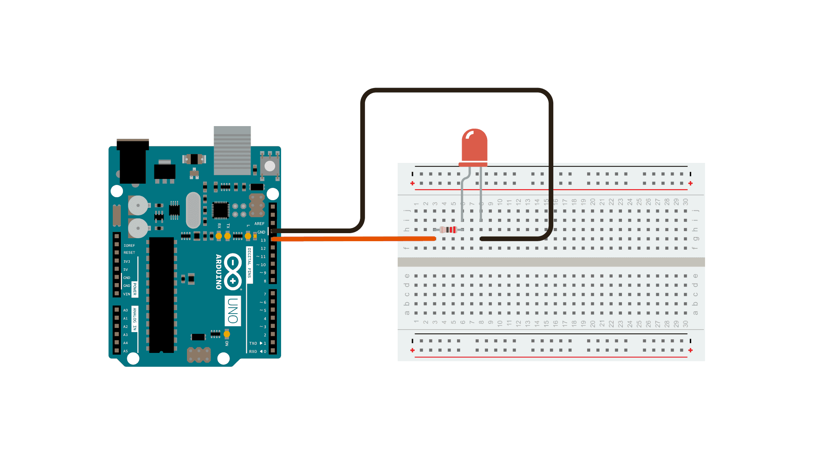

# Shoulder Recovery Device with TinyML
Hi everyone! My name is Ryan, and my main project is the Shoulder Recovery Device with TinyML. This device was made for those who have suffered from a rotator cuff injury and are looking for ways to regain full mobility of their shoulder. My goal for this project was for the device to detect different shoulder motions to inform the user of which rotations they should perform. I utilized TinyML, a less powerful version of machine learning, on the website Edge Impulse to train my Arduino Nano board to recognize different shoulder movements by feeding it data of my own recorded adjustments (left, right, idle, and up). The Arduino Nano board was able to detect these movements via a built-in accelerometer, which was able to measure the device's change in velocity. After some finetuning to make the AI model increasingly accurate, it was able to detect and label exact shoulder movements with little error. I hope you enjoy my product and work process below! 

<!--- Replace this text with a brief description (2-3 sentences) of your project. This description should draw the reader in and make them interested in what you've built. You can include what the biggest challenges, takeaways, and triumphs from completing the project were. As you complete your portfolio, remember your audience is less familiar than you are with all that your project entails! -->

| **Engineer** | **School** | **Area of Interest** | **Grade** |
|:--:|:--:|:--:|:--:|
| Ryan K | Monta Vista High School | Mechanical Engineering | Incoming Senior

 

# Final Project

 

 

# Final Milestone

<iframe width="560" height="315" src="https://www.youtube.com/embed/cBd0G1ALIac?si=ypcBQgaD3GmWAqH7" title="YouTube video player" frameborder="0" allow="accelerometer; autoplay; clipboard-write; encrypted-media; gyroscope; picture-in-picture; web-share" referrerpolicy="strict-origin-when-cross-origin" allowfullscreen></iframe>

For my final milestone, I needed to display the serial monitor information on my OLED display. To do this, I first downloaded my model from Edge Impulse into my Arduino Library before opening its example accelerometer code. I was able to modify the example C++ code using an example as a reference. Throughout this process, I learned a lot about certain C++ variables and their functions as well as how they each contributed to the code. I also faced many setbacks along the way, such as forgetting to input semicolons after each line, which slowed down the overall process. Another annoyance I faced along the way was the long data compiling time, which slowed down the process tremendously. However after cracking the code for a couple of hours and troubleshooting both the software and hardware, I was able to make a working code that displayed my shoulder inputs onto the OLED display. 

# Second Milestone

<iframe width="560" height="315" src="https://www.youtube.com/embed/cBd0G1ALIac?si=ypcBQgaD3GmWAqH7" title="YouTube video player" frameborder="0" allow="accelerometer; autoplay; clipboard-write; encrypted-media; gyroscope; picture-in-picture; web-share" referrerpolicy="strict-origin-when-cross-origin" allowfullscreen></iframe>

My second milestone included constructing my Arduino device and creating an enclosure for it on Fusion 360 and 3D printing it. To build my device, I soldered pin houses onto a PCB for my Arduino to fit on. I then soldered 4 solid wires onto the PCB to connect the A4, A5, Ground, and 3.3V pins to the corresponding SDA, SCL, Ground, and Vin pins on the OLED display. This process ensures that the battery-powered Arduino can successfully connect and power on the OLED. I then attached the Arduino to the rest of the device. However, my OLED didn't display anything. After switching countless OLED monitors, unsoldering, and resoldering, I realized I was supposed to input the wire A5 wire into A6, which was the cause of the OLED malfunction. After getting the OLED to power on, I designed the enclosure model on Fusion 360. Since I had little experience in Cadding, I sought the help of one of my instructors. He worked alongside me throughout the whole process, teaching me crucial functions such as extruding, shelling, etc. After hours of brainstorming a good design and implementing it, I was finished. I printed the 3D model and assembled it with the Arduino device to finish Milestone 2. 

# First Milestone

<iframe width="760" height="515" src="https://www.youtube.com/embed/R3pcYBH-bYE?si=uMvKYr8TdHccgHL5" title="YouTube video player" frameborder="0" allow="accelerometer; autoplay; clipboard-write; encrypted-media; gyroscope; picture-in-picture; web-share" referrerpolicy="strict-origin-when-cross-origin" allowfullscreen></iframe>

My first milestone was building a machine learning classifier for recognizing different shoulder movements. The first step of the project was to connect the Arduino Nano to my computer in order to record data of my shoulder adjustments via its built-in accelerometer. The accelerometer measures the change in motion in the form of acceleration. 

Despite my computer not detecting any input initially, I troubleshooted and discovered that the firmware of the board was outdated. By downloading software such as Arduino CLI, Edge Impulse CLI, and Brew, I was able to utilize the terminal app and its command functions to successfully update my Arduino and connect it. CLI stands for Command Line Interface, which allows the user to input commands to interact with a computer’s operating system, in my case MacOS. See Figure 1 for successful connection. 

 
*Figure 1: After downloading the required software I was able to successfully connect the Arduino circuit with my Mac.*

After establishing the connection between the Arduino and my computer, I recorded data on Edge Impulse. Edge Impulse is a website for creating machine learning models. The goal was for my Arduino to be able to detect different shoulder movements, such as to the left, right, ceiling, or idle. Using the “data acquisition” section in Edge Impulse, I recorded one minute of shoulder activity for each of the four categories, or labels. I then manually split each of the 4 data graphs into 50 sections, each section a singular rotation of my shoulder. Splitting the training data rids the data set of noise so it can be trained on good data. The data treatment ensured the machine learning model would be able to differentiate between actual shoulder adjustments and irrelevant motions. After the splitting of data, I ensured the training to testing ratio was 80%-20%, so the model would be successful when running under both conditions. I chose the 80%-20% split as it’s the industry standard to guarantee the absence of overfitting and underfitting. Overfitting happens when the model is too complex, leading to accurate performance in the training set but poor performance in the validation set. Underfitting on the other hand happens as a result of the model being too simple, unable to detect complexities in the data, thus resulting in poor performances in both the validation and training set. We are aiming for a good generalization of data. 

 
*Figure 2: Data Acquisition tab displays my training/testing split, total data collection time, and a motion graph for each of my splits.*

Several trial and error runs of collecting and splitting data later, I utilized the “NN Classifier” function to train the machine learning model. The NN Classifier (Neural Network Classifier) is a type of AI algorithm that classifies data into different categories. My most accurate model was 85.3% (see Figure 4) accurate at detecting the correct labels, which is acceptable for this first rendition. Besides the model, Edge Impulse also provided me with the metrics for the validation set. These included Weighted Average Precision Value (out of all the instances the model detected a certain motion, how many instances was it correct in detecting it) and the Weighted Average Recall Value (out of all the instances in which I performed a particular shoulder motion, how many times did the model detect it correctly). These metrics provided me with additional information on the accuracy of my model and areas for improvement for future models. 

 
*Figure 3: Above are the settings of my hyperparameters for my model and neural network architecture.*

 
*Figure 4: NN Classifier tab displays my model accuracy, confusion matrix displaying the accuracy distribution, and crucial metrics.*

With version 1 of the model complete, I deployed on the terminal app for real time display. I downloaded my model off of Edge Impulse, flashed its Mac command in my downloads folder, and ran the command “edge-impulse-run-impulse” in the terminal to initiate the deployment and testing of my model. Every 2 seconds, the value reading of the 4 labels appeared, and the readings changed based on my current shoulder movements. The higher the value reading for a certain label, the more likely I was performing that respective motion. Although some of the value readings did not match the motion I was executing, it was to be expected for the first rendition of this model. 

 
*Figure 5: Deployed on the terminal app for testing; the numbers represent the probability that the given label was performed.* 

In the future, I hope to more rigorously test on completely unseen data. For future milestones, I plan to improve the accuracy of my model by feeding Edge Impulse more specific data to retrain the model. 


# Starter Project

<iframe width="760" height="515" src="https://www.youtube.com/embed/3rn7nXZq_ys?si=nwHj_II8YJuKPDbz" title="YouTube video player" frameborder="0" allow="accelerometer; autoplay; clipboard-write; encrypted-media; gyroscope; picture-in-picture; web-share" referrerpolicy="strict-origin-when-cross-origin" allowfullscreen></iframe>

For my starter project, I made the Arduino starter. Through jumper wires, I connected the Arduino Uno to a breadboard. The photoresistor on the breadboard detects the intensity of light above it (input) and either lights up or dims the LED (output) as a result of its analog reading. For example, when I place my finger over the photoresistor, and it detects a light intensity less than 800, the LED lights up. When I remove my finger and the photoresistor detects a light intensity greater than 800, the LED dims. One major challenge I faced when making the Arduino starter was the photoresistor's incompability with another resistor on the breadboard, which was much weaker. After realizing this issue, however, it didn't take long for me to find a compatible resistor, and it was able to power my project. Since my main project, the Shoulder Recovery Device with TinyML also uses the Arduino Uno, this starter project was extremely beneficial towards my understanding of how to work with one. Attached below is the LED schematic I used as a reference: 


*Referenced from Arduino Documentation*

<!--- # Schematics 
Here's where you'll put images of your schematics. [Tinkercad](https://www.tinkercad.com/blog/official-guide-to-tinkercad-circuits) and [Fritzing](https://fritzing.org/learning/) are both great resoruces to create professional schematic diagrams, though BSE recommends Tinkercad becuase it can be done easily and for free in the browser. -->

<!--- # Code
Here's where you'll put your code. The syntax below places it into a block of code. Follow the guide [here]([url](https://www.markdownguide.org/extended-syntax/)) to learn how to customize it to your project needs.  -->

<!--- ```c++ -->
<!--- void setup() {
  // put your setup code here, to run once:
  Serial.begin(9600);
  Serial.println("Hello World!");
}

void loop() {
  // put your main code here, to run repeatedly:

}
```  -->

 # Bill of Materials

| **Part** | **Note** | **Price** | **Link** |
|:--:|:--:|:--:|:--:|
| Arduino Nano BLE 33 Sense | What the item is used for | $Price | <a href="https://www.amazon.com/Arduino-A000066-ARDUINO-UNO-R3/dp/B008GRTSV6/"> Link </a> |
| ElectroPeak 0.96" OLED 64x128 Display Module | What the item is used for | $Price | <a href="https://www.amazon.com/Arduino-A000066-ARDUINO-UNO-R3/dp/B008GRTSV6/"> Link </a> |
| Anker Portable Battery Pack | What the item is used for | $Price | <a href="https://www.amazon.com/Arduino-A000066-ARDUINO-UNO-R3/dp/B008GRTSV6/"> Link </a> |
| Switch | What the item is used for | $Price | <a href="https://www.amazon.com/Arduino-A000066-ARDUINO-UNO-R3/dp/B008GRTSV6/"> Link </a> |
| Velcro Bands | What the item is used for | $Price | <a href="https://www.amazon.com/Arduino-A000066-ARDUINO-UNO-R3/dp/B008GRTSV6/"> Link </a> |
| Solid Core Wires | What the item is used for | $Price | <a href="https://www.amazon.com/Arduino-A000066-ARDUINO-UNO-R3/dp/B008GRTSV6/"> Link </a> |
| PCB | What the item is used for | $Price | <a href="https://www.amazon.com/Arduino-A000066-ARDUINO-UNO-R3/dp/B008GRTSV6/"> Link </a> |
| Pins and Pin Headers | What the item is used for | $Price | <a href="https://www.amazon.com/Arduino-A000066-ARDUINO-UNO-R3/dp/B008GRTSV6/"> Link </a> |
| Item Name | What the item is used for | $Price | <a href="https://www.amazon.com/Arduino-A000066-ARDUINO-UNO-R3/dp/B008GRTSV6/"> Link </a> |
